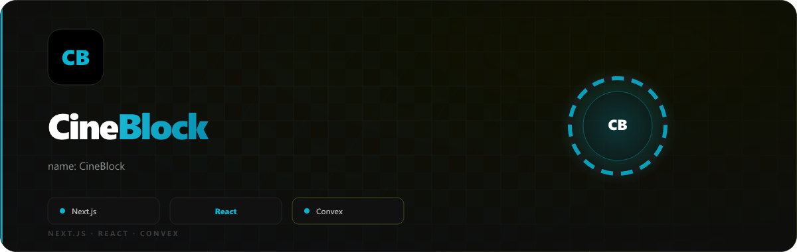

<p align="center">
  
</p>

---
name: CineBlock
version: 0.1.0
---

# CineBlock

A **next-gen movie discovery & collection app** built with **Next.js**, **React**, **Tailwind CSS**, **Convex**, and **Framer Motion**. Browse trending movies, swipe through a discovery deck, manage watchlists and liked collections, build shared rooms with friends, and back up your data locally — all wrapped in a premium glass-dark UI.

Live: **https://cineblock.in**

---

## Features

### Glass UI Theme (app-wide)
A premium visual style using dark semi-transparent surfaces, backdrop-blur, animated depth orbs, and micro-interactions — inspired by visionOS, Linear, and Raycast.

- Permanently enabled for every user; `useThemeMode()` keeps shared components on the Glass visual system
- Animated depth orbs (`globals.css`) pulse slowly behind all content in glass mode
- Glass-aware components: `PosterCard`, `MovieModal`, `MobileBottomNav`, `CommandHub`, `TrendingHero`, `ToastProvider`, `MovieActionRail`, `UserListButtons`, `SkeletonCard`, `RadarSkeleton`
- **Profile page** — identity, stats, lists, data privacy, and the MCP access panel use glass surfaces; stamps live on the dedicated `/stamps` page
- **Watch Blocks page** — `CreateBlockModal`, `JoinBlockModal`, room cards, invite panel, and empty state all switch to glass-dark cards with violet/green/cyan accents
- Legacy brutalist classes remain only for compatibility and are not exposed as a user-selectable theme

### CineSwipe — Gesture-Based Discovery (`/swipe`)
Full-screen swipe deck for discovering movies with gestures or keyboard:

| Gesture | Action |
|---|---|
| Swipe Right / → | Add to Liked |
| Swipe Left / ← | Skip |
| Swipe Up / ↑ | Add to Watchlist |
| Swipe Down / ↓ | Add to a CineBlock (with optional liked/watchlist prompt) |

- **Rate limit:** 200 swipes/day enforced server-side (`/api/swipe/limit`); remaining count shown in UI
- **Components:** `SwipeDeckView`, `SwipeCard`, `SwipeLimitScreen`, `SwipeSummaryScreen`, `SwipeTutorial`
- **Hook:** `useCineSwipeEngine` — batch movie fetching, genre/language filters, limit handling
- **Backend:** `convex/cineswipe.ts` stores swipe history and enforces the daily quota

### List Pages — Filter, Multi-Select & Similar Rows
The Liked, Watchlist, and Watched pages got a significant UX overhaul:

- **`ListFilterBar`** — filter your collection by title search, genre, release year, or director/cast (people search with TMDB typeahead). Metadata is lazily fetched and cached via `movieMetaCache`
- **`SelectionBar`** — long-press or tap the checkbox to enter multi-select mode; select any movies and bulk-add them to a new or existing CineBlock in one tap
- **`SimilarRow`** — each movie detail opens a lazy-loaded row of similar titles, triggered by IntersectionObserver (fetches only when scrolled into view)

### Personalized Recommendations (`usePersonalizedRecs`)
Smart, persistent recommendation cards built from your watched + liked history:

- Cached forever in `localStorage` — zero API calls on repeat visits
- Fingerprint-based refresh: if new movies were added since the last build, a silent background re-fetch replaces the cache seamlessly
- API cost: 1–2 TMDB discover calls per "new movies added" event

### Offline JSON Import / Export
Back up and restore your entire collection locally.

**Python CLI (`cineblock-cli.py`)** — zero dependencies (stdlib only):
```bash
# Save token once
CINEBLOCK_TOKEN=cb_... python cineblock-cli.py

# Search movies from your terminal
python cineblock-cli.py   # interactive menu
```

**API endpoint:** `POST /api/cli`
- Validates Bearer token, parses JSON body, and runs the appropriate Convex mutations
- Supports export (dumps Liked / Watchlist / Watched / CineBlocks) and import (restores a backup)

### CLI Token Authentication
Secure the CLI without exposing your password.

- **Schema fields:** `cliToken`, `cliSearchesUsed`, `cliSearchesResetAt` (convex/schema.ts)
- **Rate limit:** 15 CLI requests per day, enforced in `/api/cli`
- **User flow:** The CLI token UI is intentionally hidden until the npm package is live; keep the terminal route/package contract separate from the MCP controls shown in Profile.
- Token is stored locally in `~/.cineblock_token` for subsequent runs

The `cb_...` credential is terminal-only. It is not accepted by `/api/mcp` and is not the credential used by ChatGPT. ChatGPT/custom MCP clients use a separate `mcp_...` token (or OAuth) to read your library, preview exact movie identities, create public/private CineBlocks, and save personal Markdown stamps. The stamp flow asks four feeling-focused questions plus an optional movie-specific prompt before showing the exact poster, title, visibility, and Markdown for approval. CineBlock Terminal offers AI natural-language search with the user’s own Gemini/Groq/OpenRouter key, plus a Guided no-AI mode that asks story signal, language, and release-era questions and returns five server-ranked results.

### Watch Blocks (Collaborative Rooms)
Create a named room, share a 6-character invite code with friends, and build a shared movie list together.

- **`/blocks`** — room list with glass cards, invitation panel showing pending invites
- **`/blocks/[roomId]`** — shared movie grid; any member can add/remove titles
- `CreateBlockModal` and `JoinBlockModal` fully glass-aware with accent-color confirmation states

### TrendingHero — Touch & Animation Fixes
- All overlay/gradient `div`s marked `pointer-events-none` so iOS touch events reach underlying buttons
- Nav arrows enlarged to 40×40 px with `touchAction: manipulation`; press feedback is opacity-only (no scale transform dead zones)
- Watchlist bookmark now uses `useMovieLists` (`isInWatchlist`/`toggleWatchlist`) — was incorrectly syncing to the Liked list
- Rocket scroll-to-top in `MobileBottomNav` rebuilt with `useAnimate`; declarative show/hide + imperative blast-off animation; `launched` flag prevents snap-back

### CommandHub
Global search and command palette — major rewrite with glass mode, improved keyboard navigation, and updated action shortcuts.

### FindMyMovie Wizard
Multi-step guided movie finder (mood → genre → language → time → keywords → dealbreakers → intensity):
- All steps glass-aware
- `ResultsGrid` uses the new server-side filter API for smaller payloads

### API Filter Optimizations
Server-side filtering in `src/app/api/movies/route.ts` — genre, year, rating, and language filters applied at the database/TMDB query level rather than client-side. Reduces payload size and lowers latency on slower networks.

---

## Routes

| Path | Description |
|---|---|
| `/` | Home — TrendingHero + PosterGrid |
| `/swipe` | CineSwipe gesture deck |
| `/liked` | Liked movies (filter + multi-select) |
| `/watchlist` | Watchlist (filter + multi-select) |
| `/watched` | Watched log (filter + multi-select) |
| `/blocks` | Watch Blocks lobby |
| `/blocks/[roomId]` | Shared room |
| `/profile` | User profile, stats, MCP access |
| `/stamps` | Personal stamped films and drafts |
| `/radar` | Upcoming releases radar |
| `/recommendations` | Personalized picks |
| `/search` | Global movie/TV search |
| `/movie/[id]` | Movie detail |
| `/tv/[id]` | TV show detail |
| `/u/[username]` | Public user profile |
| `/box-office` | Box office charts |
| `/news` | Movie news |

---

## Tech Stack

| Layer | Technology |
|---|---|
| Framework | Next.js (App Router) |
| UI | React, Tailwind CSS, Framer Motion 12 |
| Backend / DB | Convex (schema in `convex/schema.ts`) |
| Auth | `@convex-dev/auth` + `@auth/core` |
| Data | TMDB API |
| CLI | Python 3 (`cineblock-cli.py`, stdlib only) |
| Analytics | Vercel Analytics |

---

## Getting Started

```bash
git clone <repo-url>
cd movieX
npm install
npm run dev
```

Open `http://localhost:3000`. Glass is enabled by default and is the only user-facing theme.

### Vercel and MCP deployment

The production MCP endpoint is:

```text
https://www.cineblock.in/api/mcp
```

For a production deployment, configure these Vercel variables without committing their values:

- `NEXT_PUBLIC_APP_URL` and `SITE_URL`: `https://www.cineblock.in`
- `MCP_ALLOWED_ORIGIN`: an explicit comma-separated allowlist for ChatGPT and the CineBlock origins; never use `*`
- `NEXT_PUBLIC_CONVEX_URL` and `NEXT_PUBLIC_CONVEX_SITE_URL`: the browser-safe URLs for the production Convex deployment
- `CONVEX_DEPLOYMENT`: the production deployment selector
- `CONVEX_DEPLOY_KEY`: the production-only Convex deploy credential used by the Vercel build

The Vercel build runs `npx convex deploy` before `next build` for Production. Environment changes apply only to new deployments, so redeploy after changing them. Dynamic client registration is available at `/api/oauth/register`; reconnect an MCP client after OAuth metadata or tool schema changes.

### CLI Usage

```bash
# Set your token (get it from /profile)
export CINEBLOCK_TOKEN=cb_your_token_here

# Run the interactive CLI
python cineblock-cli.py
```

---

## Contributing

1. Fork the repository.
2. Create a feature branch (`git checkout -b feature/your-name`).
3. Run `npm install` and `npm test`.
4. Follow the **glass-theme** styling conventions — new modals and cards should be glass-aware.
5. Open a Pull Request.

---

## License

MIT © 2026 CineBlock contributors.
<p align="center">
  
</p>
